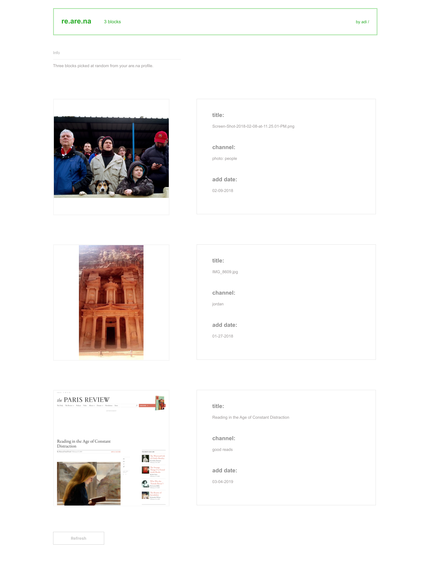

# 🔁 re.are.na
A web app that enables spaced repetition for Are.na blocks -- serving up three
random blocks from your profile.



### How to install
1. Clone this repository.
2. Create an application on [Are.na's developer page](https://dev.are.na/oauth/applications). When you're done, you
  should have a personal access token on the application's page, the link to
  which should look like this:
  `dev.are.na/oauth/applications/{APPLICATION NUMBER}`.
3. Create the file `re.are.na/.env`, as below:
  ```python
  ACCESS_TOKEN='your are.na personal access token here'
  ARENA_USERNAME = 'your are.na username here'
  ```
4. Run the following instructions:
  - `make venv` to set up a virtual environment.
  - `source venv/bin/activate` to activate the virtual environment.
  - `make install` to install the application.


### How to run the web app
1. `make server` to run the back-end / Flask server.
2. `make client` (in a separate terminal window) to run the front-end / React
  portion of this application.


### How to run the (unsecure) email service
1. Assuming you would like to schedule a job where you get three blocks
  sent to your email every day (for the sake of simplicity, sent to and from
  your own email), first open `re.are.na/.env` and add the following info:
  ```python
  EMAIL_FUNCTION_ID='your email ID'
  EMAIL_FUNCTION_PW='your email password'
  ```
2. Once you've added the above info to your `.env` file, run `make email`.

  (this should go without saying, but do <b>not</b> commit `.env` to any
  public repositories, and consider using a throwaway email ID/address for
  this particular project)

### Background
The idea for this app comes from using [Readwise](https://readwise.io) -- a service that allows you to
easily revisit Kindle highlights. Readwise claims to use the [Spaced Repetition](https://en.wikipedia.org/wiki/Spaced_repetition)
technique by resurfacing 3-5 highlights to you via a daily email.

For the sake of context, [I've used Are.na](http://are.na/adi) for close to two years now. I've
created ~100 channels, saved 6000+ blocks, and use it to organize all sorts of
content and resources.

My use cases for Are.na generally involve:
1) storing digital content, and
2) finding content I've stored -- particularly when I'm either looking for a
resource I've saved before, or when I'm looking for something in-depth to
read or peruse.

My second use case has a nice side-effect, viz., looking for specific blocks
leads to me stumbling into blocks that I'd forgotten about. Some are
interesting to stumble into because I may force myself to _actually_ spend the
time, say, reading that PDF I'd been putting off. Others are interesting to
stumble into to come back to a block months after adding it to a channel.

TL;DR -- I figured I could use a Readwise for are.na blocks, which led me to
building this.


### Other notes + bugs:
As of 9/25/2019, the `docker-compose.yml` file <i>may</i> not work as expected
due to proxy issues that need to be fixed. I would recommend either running
the web application locally, or explicitly defining your access token, are.na
username, etc. in the `config.py` file as opposed to in your `.env` file -- this
seems to be a temporary fix for now.
